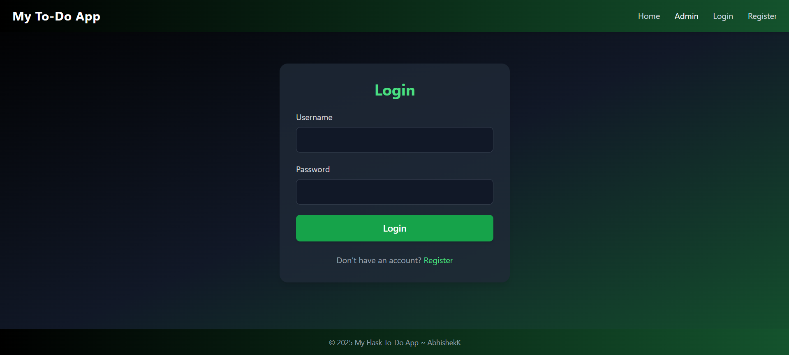
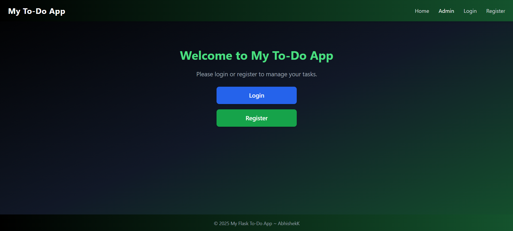
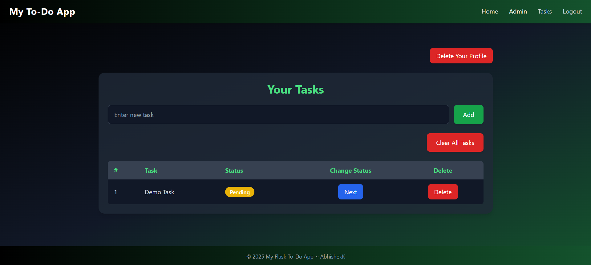
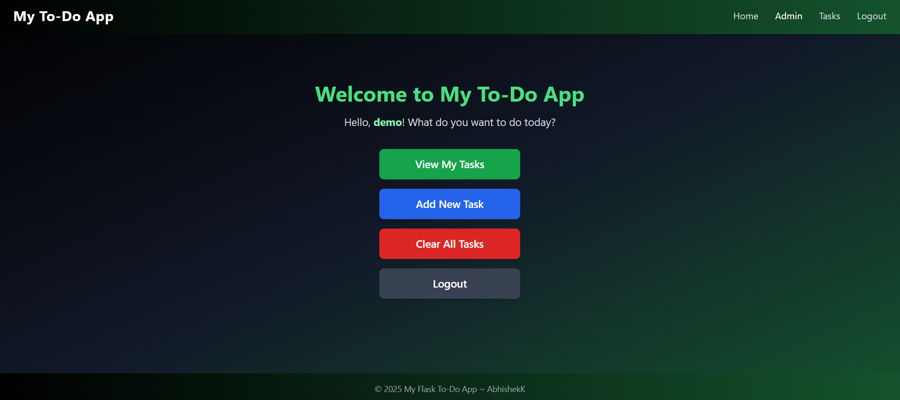
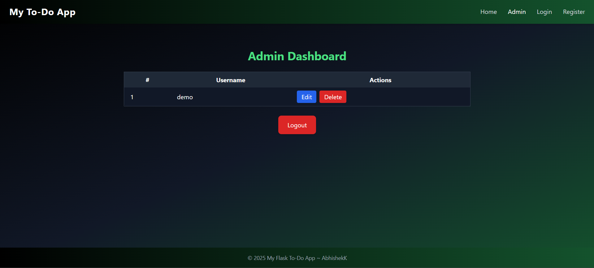

# ✅ Flask To-Do Application with Admin Panel

A simple **To-Do App** built using Flask and SQLAlchemy.  
Users can manage tasks efficiently, while admins have full control over user management.

---

## ✨ Features

### 👤 User Features
- Sign Up / Login / Logout  
- Delete own account  

### 📝 Task Management
- Add Tasks  
- Update Task Status (`Pending → Working → Done`)  
- Clear all tasks  

### 🛠 Admin Panel
- Manage users (Edit / Delete)  
- View all tasks  
- Create Admin account (`create_admin.py`)  

---

## ⚙️ Tech Stack
- **Backend:** Flask  
- **Database:** SQLAlchemy  
- **Frontend:** HTML + CSS (Tailwind optional)  

---

## 🆗 Default Credentials (for demo/testing)

| Role   | Username   | Password    |
|--------|-----------|------------|
| Admin  | admin     | admin123   |
| Demo   | demo      | demo1234   |

> You can create additional users via the registration page or admin panel.

---

## 🚀 Installation

1. Clone the repository:
```bash
git clone https://github.com/abh0x1/Flask-To-Do-App.git
cd ToDo_Flask_App
````

2. Create a virtual environment and activate it:

```bash
python -m venv venv
# Windows
venv\Scripts\activate
# Linux / Mac
source venv/bin/activate
```

3. Install dependencies:

```bash
pip install -r requirements.txt
```

4. Run the app:

```bash
python run.py
```

5. Create admin account (once):

```bash
python create_admin.py
```
---

## 📸 Screenshots

### 🔑 Login Page



### 📝 Register Page


### 🏠 Home Page



### 📝 Task Dashboard



### 👤 User Dashboard



### 🛠 Admin Dashboard



---

## 📜 License

This project is open-source and available under the **MIT License**.

---

